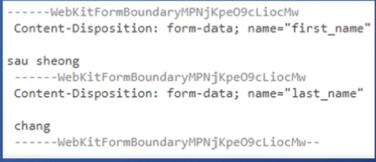
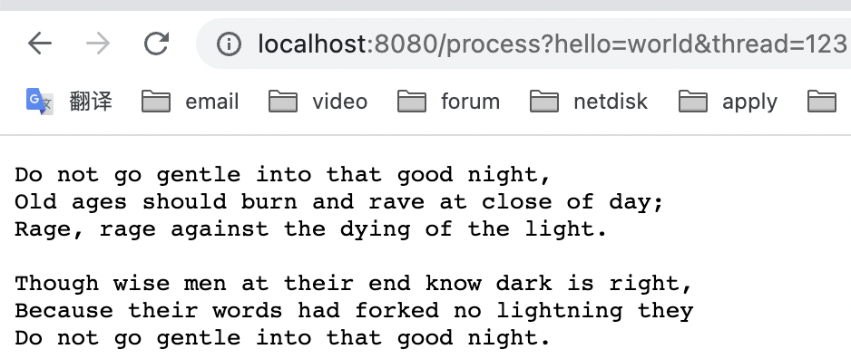
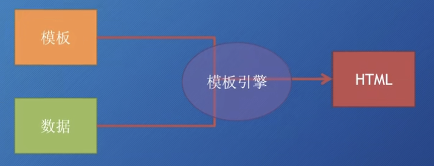
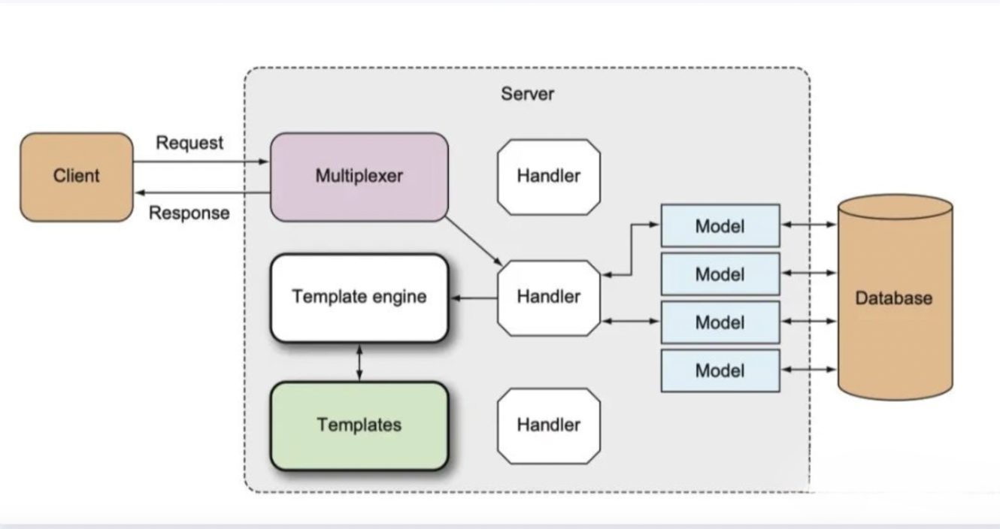
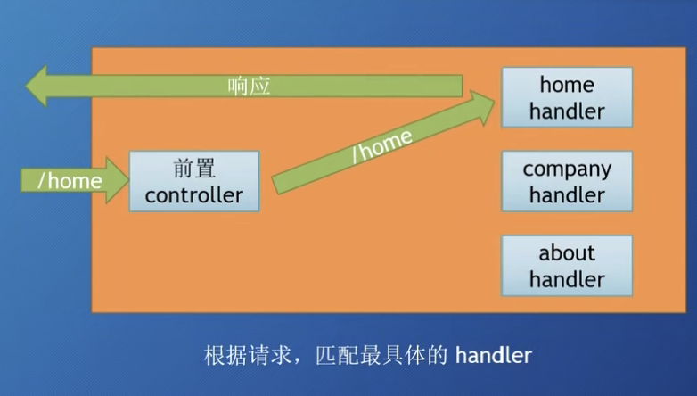

# SimpleGoWepPro

A simple go web project

## Handler

handler 是一个接口（interface）
handler 定义了一个方法 ServeHTTP()，参数：

- HTTPResponseWriter
- 指向 Request 这个 struct 的指针（包含 HTTP 请求相关的一些信息）

自行实现一个 Handler：

```go
type myHandler struct {}

func (m *myHandler) ServeHTTP(w http.ResponseWriter, r *http.Request) {
    w.Write([]byte("Hello, world!"))
}
```

## DefaultServeMux


- 它是一个 Multiplexer（多路复用器）
- 它**也是一个 Handler**

## 多个 Handler

要使用多个 Handler 处理多个路径的请求，需要的步骤为：

1. 不指定 Server struct 里面的 Handler 字段值

2. 可以使用 http.Handle 将某个 Handler 附加到 DefaultServeMux
   
   http 包有一个Handle 函数
   
   ServeMux struct 也有一个 Handle 方法

3. 如果你调用 http.Handle，实际上调用的是 DefaultServeMux 上的 Handle 方法
   
   DefaultServeMux 就是 ServeMux 的指针变量

例如：

```go
mh := helloHandler{}
server := http.Server{
    Addr: "localhost:8080",
    Handler: nil // 不指定 Handler
}
// 将 Handler 附加到 DefaultServeMux
http.Handle("/hello", &mh) // 注意，http.Handle 需要的是 Handler 指针
```

## 内置的 Handler

```go
// go 语言内置的5个handler  NOTFoundHandler  redirectHandler stripPrefixHandler  TimeoutHandle fileserver

func NOTFoundHandler() Handler
// 返回一个handler， 它给的每个请求的响应都是"404 page not found"

func RedirectHandler(url string ,code int) Handler {}
// 返回一个 handler 它的每个请求使用给定的状态码跳转到指定的 URL
 // URL 要跳转的 URL code 跳转的状态码（3xx）常见的 statusMovedPermanentrly statusFound statusseeother

 func StripPrefixHandler(prefix string, h handler) handler
 // 返回一个 handler 它从请求 URL 中去掉指定的前缀 然后再调用另一个 handler
 // 如果请求 URL 与提供的前缀不符合 那么 404
 // 有点像中间件 prefix URL 将要被移除的字符串前缀
 // h 是一个 handler 在移除字符串前缀之后 handler 将会接受到请求

func TimeoutHandler(h handler, dt time.Duration, msg string){
// 返回一个 handler 他用来在指定时间内运行传入的 h
// h 将要被修饰的handler
// dt 第一个 handler 允许的处理时间
// msg 如果超时那么就把 msg 返回给请求表示响应时间过长

func fileserver(root FileSystem) Handler
// 返回一个 handler 基于root的文件系统来响应请求
// type FileSystem struct{
//     Open (name string)(File,error)
// }
// 使用时需要到操作系统的文件系统，所以还需要委托给 type dir string
// func(d dir)Open(name string)(File,error)
```

## HTTP 消息

HTTP Request 和 HTTP Response（请求和响应）具有相同的结构：

- 请求/响应行

- 0 个或多个 Header

- 空行

- 可选的消息体（Body）

> 例子：
> 
> GET /Protocols/rfc2616.html HTTP/1.1 <-请求类型 URL HTTP 协议版本
> 
> HOST: www.w3.org
> 
> User-Agent: Mozilla/5.0
> 
> (空行)

Request（是个 struct），代表了客户端发送的 HTTP 请求消息

> 重要的字段：
> 
> - URL
> 
> - Header
> 
> - Body
> 
> - Form、PostForm、MultipartForm
> 
> 也可以通过 Request 的方法访问请求中的 Cookie、URL、User Agent 等信息
> 
> Request 既代表发送到服务端的请求，又可代表客户端发出的请求

## Form

- 表单 Post 请求的数据格式

> 通过 POST 发送的 name-value 数据对的格式可以通过表单的 Content Type 来指定，也就是 enctype 属性

```html
<form action="/process" method="post" enctype="application/x-www-form-urlencoded">
    <input type="text" name="first_name"/>
    <input type="text" name="last_name"/>
    <input type="submit"/>
</form>
```

> 如果 enctype 是 application/x-www-form-urlencoded，那么浏览器会将表单数据编码到查询字符串里面，例如：
> 
> first_name=sau%20sheong&lastname=chang
> 
> 如果是 multipart/form-data，那么每一个 name-value 对都会被转化为一个 MIME 消息部分
> 
> 每一个部分都有自己的 Content Type 和 Content Disposition



简单文本：使用 application/x-www-form-urlencoded

大量数据：使用 multipart/form-data

`r.Form` 与 `r.PostForm` 两个字段都可以在调用 `ParseForm()` 后获得表单数据，当表单与 URL 中有同样的 Key 时，PostForm 只会获取到表单中的值；值得注意的是，这两个字段只支持 application/x-www-form-urlencoded

`r.MultipartForm` 支持 multipart/form-data 格式，要使用这个字段，首先需要调用 `ParseMultipartForm()`，该方法会在必要情况下调用 ParseForm 方法，参数是需要读取数据的长度（单位：字节）

`r.MultipartForm` 只包含表单的 key-value 对，返回一个 struct，里面有两个 map：

1. key 是 string，value 是 []string

2. key 是 string，value 是文件


`r.FormValue` 会返回 Form 字段中指定 key 对应的第一个 value（无需调用 `ParseForm()` 或 `ParseMultipartForm`）

`PostFormValue` 方法也一样，但只能读取 PostForm


- Json 和文件上传

服务器处理文件上传函数：

```go
func process(w http.ResponseWriter, r *http.Request) {
	r.ParseMultipartForm(1024)

	fileHeader := r.MultipartForm.File["uploaded"][0]
	file, err := fileHeader.Open()
	if err == nil {
		data, err := ioutil.ReadAll(file)
		if err == nil {
			fmt.Fprintf(w, string(data))
		}
	}
}
```

html：

```html
<body>
    <form action="http://localhost:8080/process?hello=world&thread=123" method="post" enctype="multipart/form-data">
        <input type="text" name="hello" value="sau sheong" />
        <input type="text" name="post" value="456" />
        <input type="file" name="uploaded" />
        <input type="submit" />
    </form>
</body>
```

运行服务，用浏览器打开 html 文件，选择一个文件，点击上传：



被选中的文件的内容显示在了浏览器

当只需要上传一个文件时，可以使用 `r.FormFile()`；将服务器处理文件上传函数修改如下：

```go
func process(w http.ResponseWriter, r *http.Request) {
	// r.ParseMultipartForm(1024)

	// fileHeader := r.MultipartForm.File["uploaded"][0]
	// file, err := fileHeader.Open()
	file, _, err := r.FormFile("uploaded")

	if err == nil {
		data, err := ioutil.ReadAll(file)
		if err == nil {
			fmt.Fprintf(w, string(data))
		}
	}
}
```

## ReponseWriter

> Q：为什么 Handler 中的 ServeHTTP(w ResponseWriter, r *Request) 只有一个是指针类型？w 是按值传递的吗？
> 
> A：ResponseWriter 实质上也是一个指针

- 写入到 ResponseWriter

`Write()` 接收一个 byte 切片作为参数，会把它写入到 HTTP 响应的 Body 里面

如果在 `Write()` 被调用前，header 里面没有设定 Content-Type，那么数据的前 512 个字节就会被用来检测 Content-Type


`WriteHeader()` 接收一个整数类型（HTTP状态码）作为参数，并
把它作为 HTTP 响应的状态码返回
如果该方法没有显式调用，那么在第一次调用 Write 方法前，会隐式
的调用 `WriteHeader(http.StatusOK)`

## 模版



- 两种理想的模版引擎

无逻辑模版引擎

> 通过占位符，动态数据被替换到模板中
> 
> 不做任何逻辑处理，只做字符串替换
> 
> 处理完全由 handler 来完成
> 
> 目标是展示层和逻辑的完全分离

逻辑嵌入模板引擎

> 编程语言被嵌入到模板中
> 
> 在运行时由模板引擎来执行，也包含替换功能
> 
> 功能强大
> 
> 逻辑代码遍布 handler 和模板，难以维护

- Go 模版引擎工作原理



> 在 Web 应用中，通产是由 handler 来触发模板引擎
> handler调用模板引擎，并将使用的模板传递给引擎
> 通常是一组模板文件和动态数据模板引擎生成 HTML ,并将其写入 ResponseWriter
> ResponseWriter 再将它加入到 HTTP 响应中，返回给客户端

- 使用模板引擎

```go
func main() {
    server := http.Server{
        Addr: "localhost:8080"
    }
    http.HandleFunc("/process", process)
    server.ListenAndServe()
}


func process(w http.ResponseWriter, r *http.Request) {
    t, _ := template.ParseFiles("tmpl.html")
    t.Execute(w, "Hello, world!")
}
```

模版：

```html
<!DOCTYPE html>
<html>
<head>
    <meta http-equiv="Content-Type" content="text/html; charset=utf-8"/>
    <title>Go Web Programming</title>
</head>
<body>
    <!-- 占位符，带回会被 t.Execute() 传入的内容替代 -->
    {{ . }}
</body>
</html>
```

## 路由

目前我们的情况：

```go
func main() {
    http.HandleFunc("/...", func (w http.ResponseWriter, r *http.Request) {...})
    http.HandleFunc("/...", func (w http.ResponseWriter, r *http.Request) {...})
    http.HandleFunc("/...", func (w http.ResponseWriter, r *http.Request) {...})
    http.ListenAndServe()
}
```

是将多个不同类型的请求的处理都放在了main函数，这样显然是不合适的

- Controller 的角色

> 静态资源
> 
> 把不同的请求送到不同的 Controller 进行处理

